# Terraform AWS Deployment with GitHub Actions CI/CD [This document is a WIP]

This repository contains Terraform code demonstrating automated deployment to AWS using GitHub Actions CI/CD pipelines. The CI/CD pipelines are triggered by pull requests and include Static Code Analysis using Checkov for infrastructure as code security and compliance checks & FinOps using infracost the Frugal architect - https://thefrugalarchitect.com/.

Please note that this can also be replicated using Azure DevOps.

### A typical Infrastructure CI/CD pipeline follows the following workflow 

Business Requirement -  A customer has decided to migrate their workloads to the Cloud. They have adopted the following migration strategies 

- lift and shift for 10% of the workloads and 
- Refactoring for the remaining workloads.

NB - There are business reasons why they settled for the 2 strategies above and this is not covered in this document.

Our focus for this project is to help the customer build an automated CI/CD pipeline that deploys to 3 environments.

All 4 environments are mapped to the respective branches to make it easier to create a CI/CD pipeline. 

Dev - The development branch
Stage - For QA team to test
UAT - For user acceptance testing
Production - Production branch

The Process:

The Feature branch - where developers codes their new changes.

The feature branch will be based on a Jira ticket assigned to you e.g RA-17843

As a DevOps engineer you would create a feature branch, feature-RA-17843 & work on it.

As soon as you make a git push, and github receives the new code a pipeline should run which involves:

Build - creating a virtual environment & install all the dependencies (In case of python)

Test - Run unit test cases / Quality checks

Package - Create a package, can be a zip of code

Deploy - Send the code bundle to edge node using SCP

If we do all of these manually it will be very time consuming and error prone.

So all of the above steps should run as a automated pipeline step by step.

We can automate it using a automation server such as Jenkins.

So anytime a new branch is created, or a git push happens all of the build -> test -> package -> deploy should run without any manual involvement.

Now Let us understand the branching structure based on different environments which most of the data engineering projects follow.

Feature branches -> Dev -> Test -> UAT -> Prod

Note - In a few companies its just Dev & Prod, so it depends.

Feature branch - where developers codes their new changes.
Dev - Development branch
Stage - For QA team to test
UAT - for user acceptance testing
Prod - this is the production branch

Feature branches are short lived that means once feature branch is merge to a higher branch we can delete it.

All the other branches will be there always.so when we make a code push to feature branch in github then all the 4 steps in CICD pipeline will run.

If we see all the 4 steps ran fine, then we can raise a pull request to merge our code to Dev branch. once the reviewers see and merges it, the automated pipeline should run again on Dev branch.


### Example Scenario using Azure DevOps 

##### Deploying Terraform from develop to production consecutively using Azure DevOps


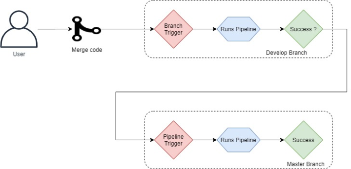

In this blog post, I am going to be diving further into deploying Azure Resources with Terraform using Azure DevOps with a CI/CD perspective in mind. I am going to show how you can deploy a develop & production terraform environment consecutively using Azure DevOps pipelines and showing how this is done by using pipeline triggers to allow you to create these environments consecutively starting from a pull request into develop . 

### What is CI/CD?

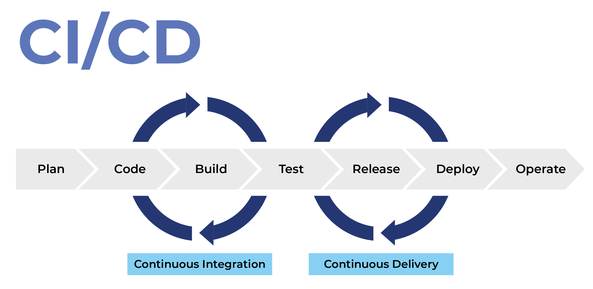


CI stands for Continuous Integration and this part if CI/CD produces the life cycle from designing the infrastructure and coding it locally to building artefacts in a seamless and consistent manner.

CD stands for Continuous Delivery and this is the final part of the CI/CD process; it does what it says, its a continous delivery! It delivers the artifact created during the CI stage and delivers it to the environment; keeping it a consistent process! CD can also be used to execute additional tests to ensure the infrastructure is in its desired state!

CI/CD pipelines are designed for businesses who want to improve their applications and infrastructure in a frequent process while requiring a reliable delivery process

CI/CD + Terraform = Dev/Ops

The environment

For this blog post, we are going to have two environments –

    Develop
    Production

Both these environments will include all the same Azure Resources

Deploying the environment, what are the consideration and requirements?

    Lets step back, even before writing any code – we need to think of a branching strategy. For this; it will be two environments, I will be going with develop/master branches
        Develop Branch:- To deploy the develop environment
        Production branch:- To deploy the production environment
    I want to deploy the environment using Terraform

Time to deploy !
Branching Strategy

The full branching strategy I am not going to cover in this blog post; it would be a different blog all together.

New to development and CI/CD? I do recommend looking at a feature branch strategy:-
Feature Branching Using Feature Flags

### Feature Branching Using Feature Flags

Feature branching allows developers to effectively collaborate around a central code base by keeping all changes to a specific feature in its own branch. With the addition of feature flags, feature branching becomes even more powerful and faster by separating feature release management from code deployment.

###### The Pains of Long-Lived Branching

Traditionally, new development has been done via branching. These branches typically live for months at a time, with silos of developers attempting to work in parallel. Long-lived branches often become the “I owe you” of Gitflow: “I promise to address these merge conflicts… later.” The pain points that Git was supposed to address--merge conflicts, missing dependencies, and duplicate code--gradually emerge the longer a branch lasts. We then concentrate all the pain of reworks and conflict remedies until the end, which arguably makes the pain much worse. To avoid these long-lived branching issues, branching with feature flags enables devs to effectively manage short-lived feature branches and continuously deliver better software.

###### Feature Branching

To help coordinate development, engineering teams have adopted distributed version control systems (like GitHub and BitBucket). These systems allow developers to collaborate within a central codebase and use branches to make updates or develop new features. Feature branching, therefore, has become a staple of modern development cycles because they allow developers to function without encroaching on each other's progress.

One of the shortcomings of feature branching is that feature release management is still tied to code deployments. In isolation, feature branching forces engineers to manage software delivery within the confines of their version control system. Non-technical users can't (and shouldn't) manage feature visibility and distribution for customers from GitHub. It is currently not possible for developers to turn features on or off in real-time, as a way to manage risk or gradually introduce a new feature.

###### Feature Branching Without Feature Flags 

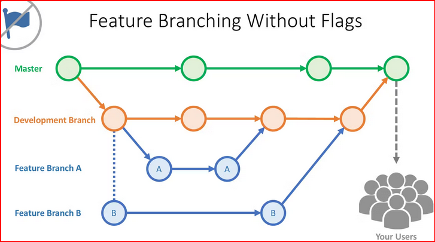

This diagram illustrates how developers create feature branches to manage feature development, ensuring that the current build is always in a deployable state. While every company's branching structure will be different, the basic premise is that you branch from a repository to make a new feature.

###### Feature Branching Using Feature Flags

This is where the introduction of feature flags makes feature branching exceptionally powerful. Feature flagging allows developers to take full control of their feature lifecycles independent of code deployments.  Application features can be enabled or disabled without requiring code to be reverted or redeployed.

This process is called feature flag driven development, where continuous delivery teams manage feature rollouts separate from code deployments.

###### Feature Branching With Feature Flags 

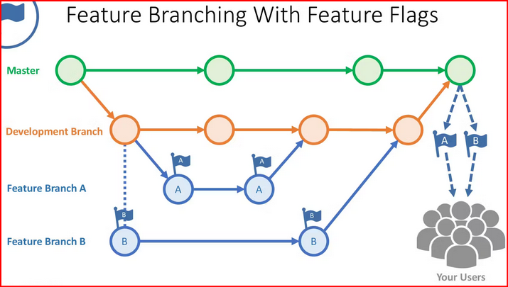

Benefits

Feature flagging allows developers to take full control of their feature lifecycles without depending on code deployments.  When you merge a feature branch into master (production), it is already wrapped in a feature flag. This allows you to deploy the feature “off” and then gradually roll it out to users. It also allows you to quickly “kill” the feature if it is not working well, without having to redeploy. Other benefits include:

- Better team communication

    Developers continuously collaborate on new releases, coordinate efforts, and ensure that everyone is moving forward in tandem.

- Logical deployments to prevent blocking

    Deploy code in logical chunks without resorting to long-lived branching.  Even if a feature is not fully ready, it can be flagged ‘off', but still deployed.

- Exposed dependencies

    Short-lived branching allows you to manage dependencies by removing the ones that are unnecessary.

- Faster development

    Spend less time addressing merge conflicts and refactoring old code.  Spend more time delivering features that users want.

- Risk mitigation

    A feature can be flagged throughout the entire development process, from local, QA, staging, and production. This means that it can be toggled on or off in isolation, without impacting other development environments.

- Manageable code reviews

    Because you are merging more often, code reviews become less tedious and merge conflicts less onerous.

Better, Together

Modern DVCS combines the benefits of short-lived branches and feature flags. Tools like GitHub and Bitbucket enable continuous delivery and short-lived branching, while feature flags help make branching faster, less risky, and more manageable.
Therefore, feature flagging does not replace branching, it is complementary and makes it more powerful. Feature branching provides the flexibility to decide when and what to release, while feature flagging lets you take full control of the release itself. Together, branching and flagging help you maintain and integrate short-lived branches faster and with less risk.


###########################################################################################################################

For this blog, I am going to be using two branches as mentioned:-

    - Develop Branch:- To deploy the develop environment
    - Production branch:- To deploy the production environment

In theory:- I will be writing any changes or additions to develop and once merged into develop; a branch trigger will then run the develop environment pipeline. Once develop environment has been completed successfully; another pipeline will be ran to run the Production environment. This will be ran using a pipeline trigger

###### Triggers

Use a trigger to run a pipeline automatically. Azure Pipelines does support quite a number of triggers; I do recommend you reading this post to view more types of triggers and depending what you are looking to do, select the appropriate trigger.

Use triggers to run a pipeline automatically. Azure Pipelines supports many types of triggers. Based on your pipeline’s type, select the appropriate trigger from the list below:

Branch Trigger

Branch Triggers are used to run a branch automatically once a branch has been updated. I will be using them:-

    - When a pull request has been approved into develop

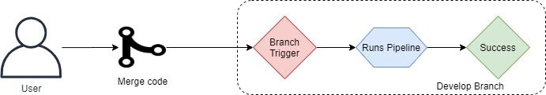

Pipeline Trigger

Pipeline triggers are triggered whenever another pipeline has been successfully completed, deploying an app? You could have multiple pipelines with pipeline triggers, starting to get into the “CI/CD” world 


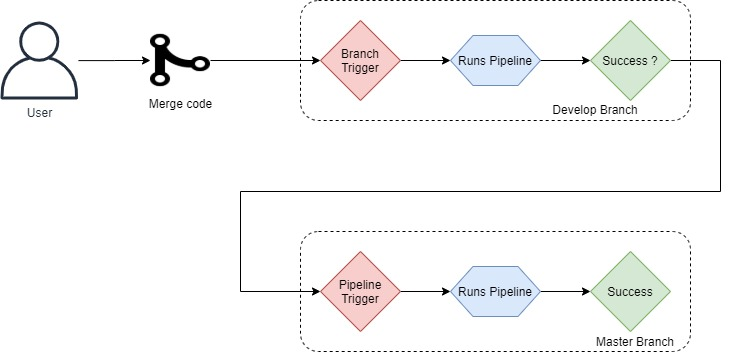

Awesome; so far I’ve covered a recommended branching strategy and the Triggers that we will be using; now lets look at Terraform and continue the CI/CD journey!

###### The Terraform Code

Time to take you through the journey that I want to achieve with the above; continuous triggers that will deploy both develop & production environment after I create and merge code into the Develop Branch

Lets work on the initial Terraform code

For my example to show deployments between develop & production environments, I am going to create a storage account static website; below shows the Production example, with develop showing “Develop” instead of “Production“

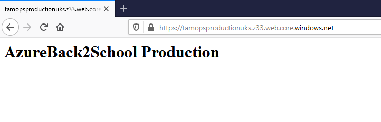

Folder Structure for my Terraform Deployment (Throughout this blog post I will be adding more folders/files to this structure)


Azure-Back-to-School
    └──develop
            └──develop.tfvars
            └──index.html
    └──production
            └──develop.tfvars
            └──index.html
    └──terraform
            └── main.tf
            └── variables.tf

Terraform folder:-


main.tf
	
``` 
provider "azurerm" {
    # The "feature" block is required for AzureRM provider 2.x.
    # If you're using version 1.x, the "features" block is not allowed.
    version = "~>2.0"
    features {}
}
 
 terraform {
     backend "azurerm" {
         resource_group_name = "tamopstf"   
         storage_account_name = "thomastfstate"
         container_name = "terraform.tfstate"
     }
 }
 
data "azurerm_client_config" "current" {}
 
#Create Resource Group
resource "azurerm_resource_group" "tamops" {
  name     = var.resource_group_name
  location = var.location 
}
 
#Create Storage account
resource "azurerm_storage_account" "storage_account" {
  name                = var.storage_account_name
  resource_group_name = azurerm_resource_group.tamops.name
 
  location                 = var.location
  account_tier             = "Standard"
  account_replication_type = "LRS"
  account_kind             = "StorageV2"
 
  static_website {
    index_document = "index.html"
  }
}
 
#Add index.html to blob storage
resource "azurerm_storage_blob" "example" {
  name                   = "index.html"
  storage_account_name   = azurerm_storage_account.storage_account.name
  storage_container_name = "$web"
  type                   = "Block"
  content_type           = "text/html"
  source                 = var.sa_web_source
}
```

variables.tf

```
	
variable "location" {
  type        = string
  description = "Default resources location"
}
 
variable "storage_account_name" {
  type        = string
  description = "Storage account name"
}
 
variable "resource_group_name" {
  type        = string
  description = "Storage account name"
}
 
variable "sa_web_source" {
  type        = string
  description = "Source Index Web Page Location"
}

```

index.html (shows both Development and Production)
	
<h1> AzureBack2School Development </h1>
<h1> AzureBack2School Production </h1>

.tfvars

Notice both Develop & Production have reference to .tfvars? Here is a good summary of .tfvars and its usage, taken from here:-

This tells Terraform that this module accepts an input variable called example. Stating this makes it valid to use var.example elsewhere in the module to access the value of the variable.

There are several different ways to assign a value to this input variable:

    Include -var options on the terraform plan or terraform apply command line.
    Include -var-file options to select one or more .tfvars files to set values for many variables at once.
    Create a terraform.tfvars file, or files named .auto.tfvars, which are treated the same as -var-file arguments but are loaded automatically.
    For a child module, include an expression to assign to the variable inside the calling module block.

A variable can optionally be declared with a default value, which makes it optional. Variable defaults are used for situations where there’s a good default behavior that would work well for most uses of the module/configuration, while still allowing that behavior to be overridden in exceptional cases.

The various means for assigning variable values are for dealing with differences. What that means will depend on exactly how you are using Terraform, but for example if you are using the same configuration multiple times to deploy different “copies” of the same infrastructure (environments, etc) then you might choose to have a different .tfvars file for each of these copies.

Because terraform.tfvars and .auto.tfvars are automatically loaded without any additional options, they behave similarly to defaults, but the intent of these is different. When running Terraform in automation, some users have their automation generate a terraform.tfvars file or .auto.tfvars just before running Terraform in order to pass in values the automation knows, such as what environment the automation is running for, etc.

The difference between the automatically-loaded .tfvars files and variable defaults is more clear when dealing with child modules. .tfvars files (and -var, -var-file options) only apply to the root module variables, while variable defaults apply when that module is used as a child module too, meaning that variables with defaults can be omitted in module blocks.

develop.tfvars

```	
location                = "ukwest"
storage_account_name    = "tamopsdevelopukw"
resource_group_name     = "tamops-develop"
sa_web_source           = "../develop/index.html"

```

production.tfvars

```	
location                = "uksouth"
storage_account_name    = "tamopsproductionuks"
resource_group_name     = "tamops-production"
sa_web_source           = "../production/index.html"

```

Terraform setup is now complete!

###### Azure DevOps Pipeline(s)

Running the code to build the environment will be ran in an Azure DevOps Pipeline(s).

This will consist of two pipelines:-

    - Develop-Pipeline.yaml:- To deploy the Develop environment
    - Production-Pipeline.yaml:- To deploy the Production environment

Folder update!
	
Azure-Back-to-School
    └──develop
            └──develop.tfvars
            └──index.html
    └──pipelines
            └──Develop-Pipeline.yaml
            └──Production-Pipeline.yaml
    └──production
            └──develop.tfvars
            └──index.html
    └──terraform
            └── main.tf
            └── variables.tf

Develop-Pipeline.yaml

```
	
name: $(BuildDefinitionName)_$(date:yyyyMMdd)$(rev:.r)
 
variables:
  - group: azureback2school-develop
   
# Only run against develop
trigger:
  batch: true # batch changes if true (the default); start a new build for every push if false
  branches:
    include:
      - develop
 
# Don't run against PRs
pr: none
 
stages :
  - stage: validate
    jobs:
    - job: validate
      continueOnError: false
      steps:
      - task: TerraformInstaller@0
        displayName: 'install'
        inputs:
          terraformVersion: '0.13.3'
      - task: TerraformTaskV1@0
        displayName: 'init'
        inputs:
          provider: 'azurerm'
          command: 'init'
          backendServiceArm: 'tamopstf'
          backendAzureRmResourceGroupName: 'tamopstf'
          backendAzureRmStorageAccountName: 'thomastfstate'
          backendAzureRmContainerName: 'tamopsazurebacktoschool'
          backendAzureRmKey: 'terraform.tfstate'
          workingDirectory: '$(System.DefaultWorkingDirectory)/terraform/'
      - task: TerraformTaskV1@0
        displayName: 'validate'
        inputs:
          provider: 'azurerm'
          command: 'validate'
           
  - stage: plan
    dependsOn: [validate]
    condition: succeeded('validate')
    jobs:
      - job: terraform_plan_develop
        steps:
              - checkout: self
              - task: TerraformInstaller@0
                displayName: 'install'
                inputs:
                  terraformVersion: '0.13.3'
              - task: TerraformTaskV1@0
                displayName: 'init'
                inputs:
                  provider: 'azurerm'
                  command: 'init'
                  backendServiceArm: 'tamopstf'
                  backendAzureRmResourceGroupName: 'tamopstf'
                  backendAzureRmStorageAccountName: 'thomastfstate'
                  backendAzureRmContainerName: 'tamopsazurebacktoschool'
                  backendAzureRmKey: 'terraform.tfstate'
                  workingDirectory: '$(System.DefaultWorkingDirectory)/terraform/'
              - task: TerraformTaskV1@0
                displayName: 'plan'
                inputs:
                  provider: 'azurerm'
                  command: 'plan'
                  commandOptions: '-input=false -var-file="../$(Environment)/$(Environment).tfvars"'
                  environmentServiceNameAzureRM: 'tamopstf'
                  workingDirectory: '$(System.DefaultWorkingDirectory)/terraform/'
 
  - stage: apply
    dependsOn: [plan]
    condition: succeeded('plan')
    jobs:
      - job: terraform_apply_develop
        steps:
              - checkout: self
              - task: TerraformInstaller@0
                displayName: 'install'
                inputs:
                  terraformVersion: '0.13.3'
              - task: TerraformTaskV1@0
                displayName: 'init'
                inputs:
                  provider: 'azurerm'
                  command: 'init'
                  backendServiceArm: 'tamopstf'
                  backendAzureRmResourceGroupName: 'tamopstf'
                  backendAzureRmStorageAccountName: 'thomastfstate'
                  backendAzureRmContainerName: 'tamopsazurebacktoschool'
                  backendAzureRmKey: 'terraform.tfstate'
                  workingDirectory: '$(System.DefaultWorkingDirectory)/terraform/'
              - task: TerraformTaskV1@0
                displayName: 'plan'
                inputs:
                  provider: 'azurerm'
                  command: 'plan'
                  commandOptions: '-input=false -var-file="../$(Environment)/$(Environment).tfvars"'
                  environmentServiceNameAzureRM: 'tamopstf'
                  workingDirectory: '$(System.DefaultWorkingDirectory)/terraform/'
              - task: TerraformTaskV1@0
                displayName: 'apply'
                inputs:
                  provider: 'azurerm'
                  command: 'apply'
                  commandOptions: '-input=false -auto-approve -var-file="../$(Environment)/$(Environment).tfvars"'
                  environmentServiceNameAzureRM: 'tamopstf'
                  workingDirectory: '$(System.DefaultWorkingDirectory)/terrafor

```


###### What will the develop pipeline do?

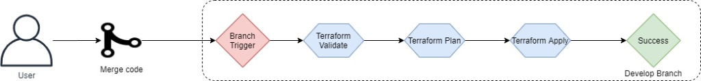


Production-Pipeline.yaml

```
name: $(BuildDefinitionName)_$(date:yyyyMMdd)$(rev:.r)
 
variables:
  - group: azureback2school-production
   
resources:
  pipelines:
    - pipeline: Azure-Back-to-School-Production
      source: Azure-Back-to-School-Develop
      trigger:
        branches:
          include:
            - master
 
 
# Don't run against PRs
pr: none
 
stages :
  - stage: validate
    jobs:
    - job: validate
      continueOnError: false
      steps:
      - task: TerraformInstaller@0
        displayName: 'install'
        inputs:
          terraformVersion: '0.13.3'
      - task: TerraformTaskV1@0
        displayName: 'init'
        inputs:
          provider: 'azurerm'
          command: 'init'
          backendServiceArm: 'tamopstf'
          backendAzureRmResourceGroupName: 'tamopstf'
          backendAzureRmStorageAccountName: 'thomastfstate'
          backendAzureRmContainerName: 'tamopsazurebacktoschool'
          backendAzureRmKey: 'terraform.tfstate'
          workingDirectory: '$(System.DefaultWorkingDirectory)/terraform/'
      - task: TerraformTaskV1@0
        displayName: 'validate'
        inputs:
          provider: 'azurerm'
          command: 'validate'
           
  - stage: plan
    dependsOn: [validate]
    condition: succeeded('validate')
    jobs:
      - job: terraform_apply_production
        steps:
              - checkout: self
              - task: TerraformInstaller@0
                displayName: 'install'
                inputs:
                  terraformVersion: '0.13.3'
              - task: TerraformTaskV1@0
                displayName: 'init'
                inputs:
                  provider: 'azurerm'
                  command: 'init'
                  backendServiceArm: 'tamopstf'
                  backendAzureRmResourceGroupName: 'tamopstf'
                  backendAzureRmStorageAccountName: 'thomastfstate'
                  backendAzureRmContainerName: 'tamopsazurebacktoschool'
                  backendAzureRmKey: 'terraform.tfstate'
                  workingDirectory: '$(System.DefaultWorkingDirectory)/terraform/'
              - task: TerraformTaskV1@0
                displayName: 'plan'
                inputs:
                  provider: 'azurerm'
                  command: 'plan'
                  commandOptions: '-input=false -var-file="../$(Environment)/$(Environment).tfvars"'
                  environmentServiceNameAzureRM: 'tamopstf'
                  workingDirectory: '$(System.DefaultWorkingDirectory)/terraform/'
 
  - stage: apply
    dependsOn: [plan]
    condition: succeeded('plan')
    jobs:
      - job: terraform_plan_production
        steps:
              - checkout: self
              - task: TerraformInstaller@0
                displayName: 'install'
                inputs:
                  terraformVersion: '0.13.3'
              - task: TerraformTaskV1@0
                displayName: 'init'
                inputs:
                  provider: 'azurerm'
                  command: 'init'
                  backendServiceArm: 'tamopstf'
                  backendAzureRmResourceGroupName: 'tamopstf'
                  backendAzureRmStorageAccountName: 'thomastfstate'
                  backendAzureRmContainerName: 'tamopsazurebacktoschool'
                  backendAzureRmKey: 'terraform.tfstate'
                  workingDirectory: '$(System.DefaultWorkingDirectory)/terraform/'
              - task: TerraformTaskV1@0
                displayName: 'plan'
                inputs:
                  provider: 'azurerm'
                  command: 'plan'
                  commandOptions: '-input=false -var-file="../$(Environment)/$(Environment).tfvars"'
                  environmentServiceNameAzureRM: 'tamopstf'
                  workingDirectory: '$(System.DefaultWorkingDirectory)/terraform/'
              - task: TerraformTaskV1@0
                displayName: 'apply'
                inputs:
                  provider: 'azurerm'
                  command: 'apply'
                  commandOptions: '-input=false -auto-approve -var-file="../$(Environment)/$(Environment).tfvars"'
                  environmentServiceNameAzureRM: 'tamopstf'
                  workingDirectory: '$(System.DefaultWorkingDirectory)/terraform/'

```

###### What will the production pipeline do?

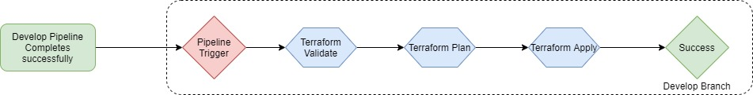

Sounds great, although I want to test the website URL before 

The pipeline breakdown

Both pipelines have been created similarly

    Both use variable groups, read more here about variable groups and their usage (I have one variable in each, which is environment = develop or production, depending on the environment)
    Next, notice each have reference to a trigger as I described at the start of this blog?
    Both for now, will not run if have a pr has been created
    Three stages, terraform related to validate, plan , deploy

Running the Pipeline
Where to store the Terraform state file?

When deploying Terraform there is a requirement that it must store a state file; this file is used by Terraform to map Azure Resources to your configuration that you want to deploy, keeps track of meta data and can also assist with improving performance for larger Azure Resource deployments.

In these pipelines, I want to store the state file remotely in Azure; I will be storing my state file in a Storage Account container called:- tamopsazurebacktoschool

Lets deploy the required storage container called tamopsazurebacktoschool in Storage Account thomastfstate inside Resource Group tamopstf

Terraform must store state about your managed infrastructure and configuration. This state is used by Terraform to map real world resources to your configuration, keep track of metadata, and to improve performance for large infrastructures.


```

#Create Resource Group
New-AzureRmResourceGroup -Name "tamopstf" -Location "eastus2"
 
#Create Storage Account
New-AzureRmStorageAccount -ResourceGroupName "tamopstf" -AccountName "thomastfstate" -Location eastus2 -SkuName Standard_LRS
 
#Create Storage Container
New-AzureRmStorageContainer -ResourceGroupName "tamopstf" -AccountName "thomastfstate" -ContainerName "tamopsazurebacktoschool"

```


I have two pipelines setup:-

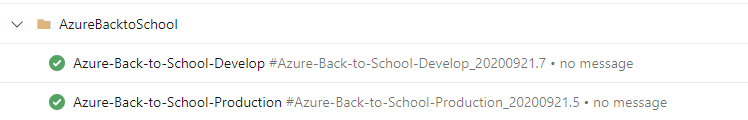


Ensure you have two branches; master will be created by default; now create an additional branch called “develop”

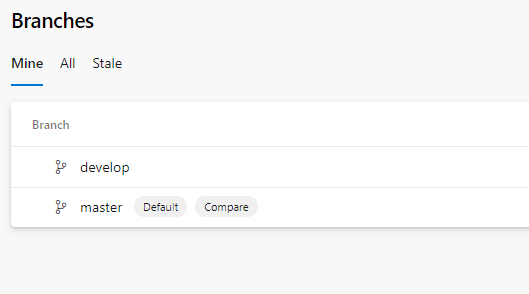

Now create a pull request for develop, in my example – I have added to both index.html

develop/index.html

```	
<h1> AzureBack2School Development </h1>
<h1> Pull request test </h1>

```

production/index.html

```
	
<h1> AzureBack2School Production </h1>
<h1> Built with pipeline trigger </h1>

```

Now to merge this into the develop branch

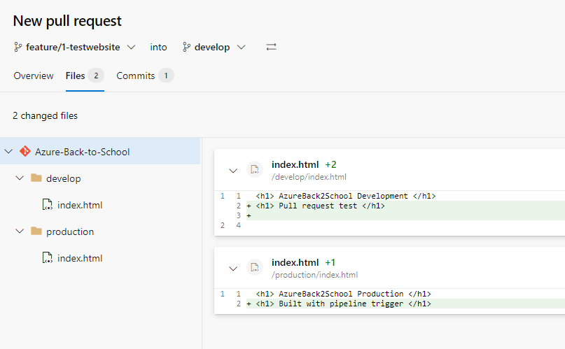

Once merged; the magic begins to happen!

Review the pipelines and you will notice the development pipeline has been kicked off

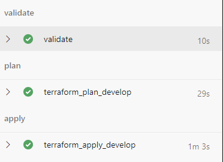

Check in Azure Portal

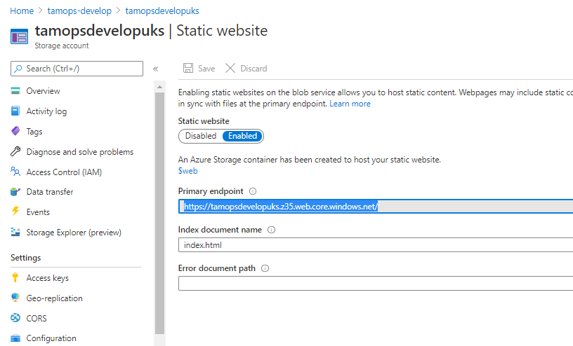

URL Check:-

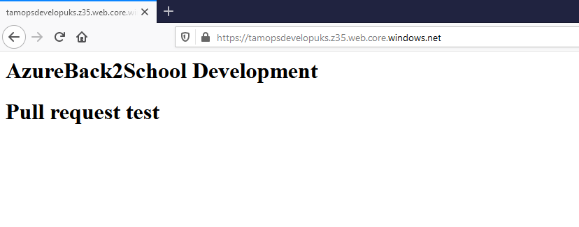


Now check the Azure DevOps Pipelines again; now that develop pipeline has finished successfully, Production pipeline now begins automatically!

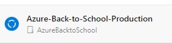

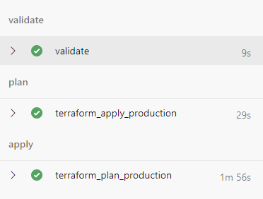


Check in Azure Portal

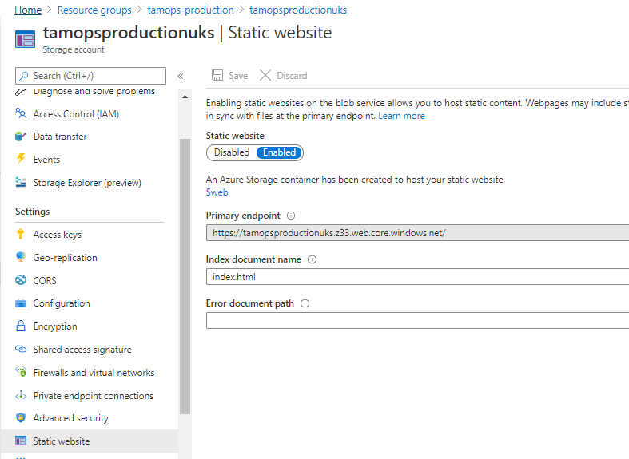


URL check:-

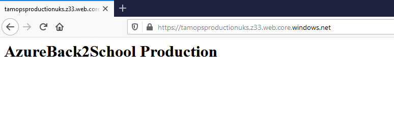


Wrap up

Wow – its been another fun blog post; hopefully you’ve followed it successfully and have a similar output as I have above!

Azure DevOps is super powerful and this is only the tip of the iceberg in relation to taking you on the CI/CD journey!

As I mentioned previously; remember to check out my recommended reads!

Deploy Terraform Using Azure DevOps

Validating Terraform code during a Pull Request in Azure DevOps

Inspec Azure in Azure DevOps Pipeline


## Overview

This repository showcases how to use Terraform to provision infrastructure on AWS and integrate it with GitHub Actions for continuous integration and continuous deployment (CI/CD). The GitHub Actions workflows are configured to automatically execute Terraform scripts upon pull request creation or update.

## Features

- Automated deployment of infrastructure to AWS using Terraform.
- GitHub Actions CI/CD pipelines for automated testing and deployment.
- Pull request triggers for CI/CD pipelines.
- Automated tests using Checkov for infrastructure as code security and compliance.

## Requirements

- AWS account with appropriate permissions.
- GitHub repository for hosting Terraform code.
- Terraform installed on your local machine.
- GitHub Actions configured for the repository.

## Getting Started

1. Clone this repository to your local machine:

        git clone https://github.com/your-username/terraform-aws-deployment.git
        cd terraform-aws-deployment

2. Configure your AWS credentials

 #### Configure your AWS credentials as below only for testing


            export AWS_ACCESS_KEY_ID="your-access-key-id"
            export AWS_SECRET_ACCESS_KEY="your-secret-access-key"

 #### Configure your AWS credentials using GitHub Actions secrets

To securely configure your AWS credentials for use in GitHub Actions workflows, you can utilize GitHub Secrets. Follow these steps to set up your AWS credentials as secrets:

1. **Generate AWS Access Key and Secret Key**: Log in to your AWS Management Console, navigate to the IAM (Identity and Access Management) dashboard, and create a new IAM user with programmatic access. Once created, note down the Access Key ID and Secret Access Key.

2. **Add GitHub Secrets**: In your GitHub repository, go to the "Settings" tab and select "Secrets" from the sidebar. Click on "New repository secret" and add the following secrets:
   - `AWS_ACCESS_KEY_ID`: Set this to the Access Key ID generated in step 1.
   - `AWS_SECRET_ACCESS_KEY`: Set this to the Secret Access Key generated in step 1.

3. **Update GitHub Actions Workflow**: Modify your GitHub Actions workflow (`.github/workflows/main.yml`) to utilize these secrets. Here's an example of how you can use these secrets in your workflow:

```yaml
name: Terraform AWS Deployment

on:
  push:
    branches:
      - master
  pull_request:
    branches:
      - master

jobs:
  terraform:
    runs-on: ubuntu-latest
    steps:
      - name: Checkout Repository
        uses: actions/checkout@v2

      - name: Configure AWS Credentials
        uses: aws-actions/configure-aws-credentials@v1
        with:
          aws-access-key-id: ${{ secrets.AWS_ACCESS_KEY_ID }}
          aws-secret-access-key: ${{ secrets.AWS_SECRET_ACCESS_KEY }}
          aws-region: us-west-2

      # Add more steps for Terraform deployment...
```

3. Customize the Terraform configuration files as needed for your infrastructure requirements.
4. Commit and push your changes to GitHub:

        git add .
        git commit -m "Update Terraform configuration"
        git push origin master


5. Create a pull request in GitHub to trigger the CI/CD pipelines.

6. Monitor the GitHub Actions workflows for automated testing and deployment.


#### Contributing

Contributions are welcome! If you encounter any issues or have suggestions for improvements, please open an issue or submit a pull request.

#### License

This project is licensed under the MIT License - see the LICENSE file for details.


    This README provides an overview of your repository, including its purpose, features, requirements, getting started guide, contribution guidelines, and license information. Adjust it as needed to fit your specific project details and preferences.


### Disable a direct push to GitHub main branch

On a development team, you never want to push directly to the main branch. Instead, you want to require changes to be made through pull requests so they can be properly reviewed by other developers.

Some developers, including myself, occasionally forget to push to a new branch so I like to have an automated check to prevent this mistake. Here are two methods to block direct pushes to the GitHub main branch.

### Pre-commit hook

The pre-commit framework includes a no-commit-to-branch hook which blocks direct commits to specific branches. By default, it blocks the master and main branches.

You can implement this by adding the following .pre-commit-config.yaml file to the repository root:

repos:
  - repo: https://github.com/pre-commit/pre-commit-hooks
    rev: v4.4.0
    hooks:
      - id: no-commit-to-branch

Then run pre-commit install. Now commits to main will result in an error:

$ git commit -m "My change"
don't commit to branch...................................................Failed
- hook id: no-commit-to-branch
- exit code: 1

Note, you can work around this check by uninstalling the pre-commit hook so it’s not foolproof.
### Branch protection rule


GitHub has branch protection rules which allow you to enforce workflows for a one or more branches.

To create a branch protection rule, navigate to your repository’s settings. Click Branches and then Add rule under the “Branch protection rules” section.

Enter “main” under Branch name pattern. Then check Require a pull request before merging.

You’ll notice some additional features pop up. I generally check Require approvals so developers can’t sneak a change through without a proper sign-off.

Lastly, you may want to check Do not allow bypassing the above settings so the rule applies to repository admins. Keep in mind, however, that some git tools, such as Flux, need this access or they won’t work. So be cognizant of the tools you’re using and the privileges they need.

When you’re done, your rule should look like this:

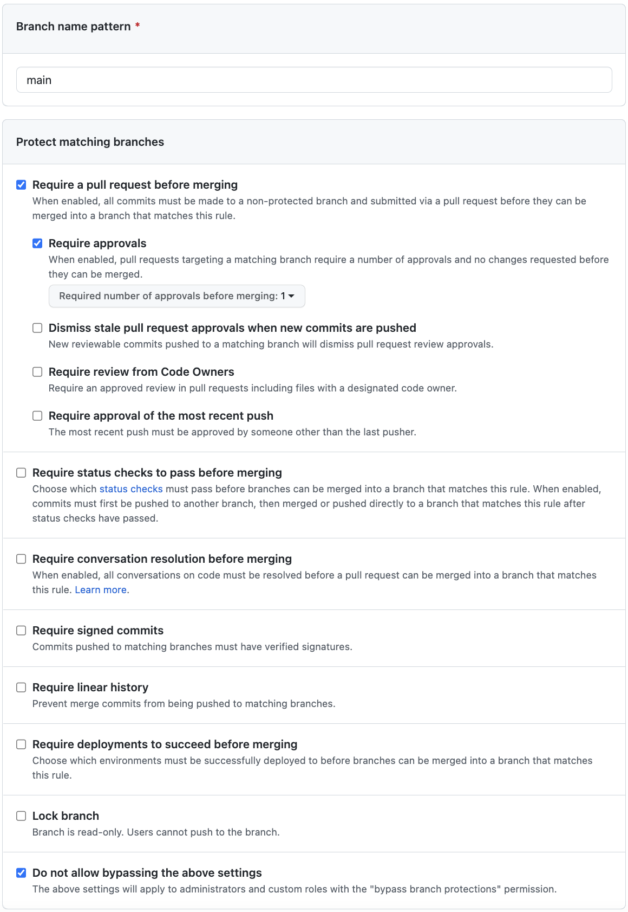

Now direct pushes to main will result in an error:

$ git push
...
remote: error: GH006: Protected branch update failed for refs/heads/main.
remote: error: Changes must be made through a pull request.
To github.com:johnnymetz/my-repo.git
 ! [remote rejected] main -> main (protected branch hook declined)
error: failed to push some refs to 'github.com:johnnymetz/my-repo.git'


### Conclusion

You can utilize both methods at the same time, which is what I do. However, I encourage all teams to implement at least the branch protection rule because it’s foolproof and includes additional features.
