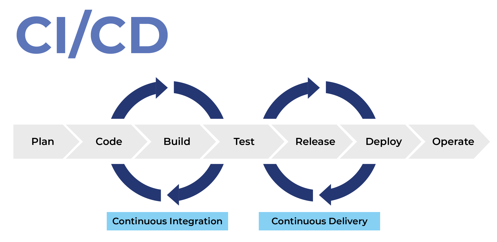
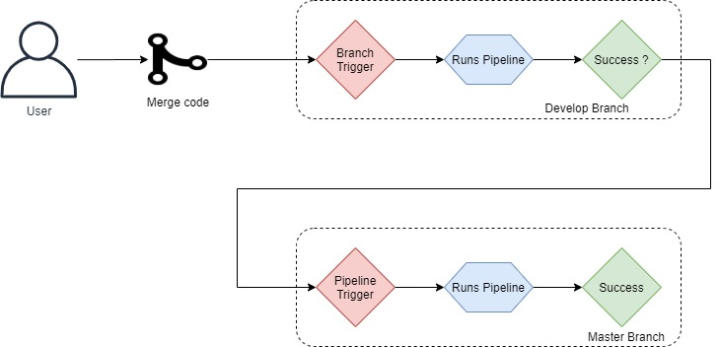
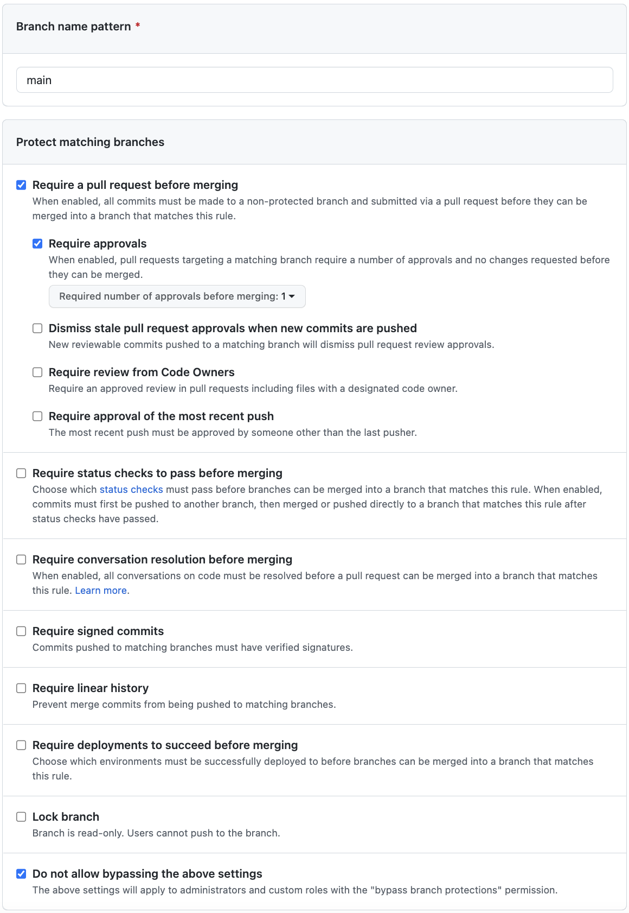

# Terraform AWS Deployment with GitHub Actions CI/CD

Automated AWS infrastructure deployment using Terraform with GitHub Actions CI/CD pipelines. Includes static code analysis via [Checkov](https://www.checkov.io/) and cost estimation via [Infracost](https://www.infracost.io/).

## Overview

This project deploys a VPC-based AWS infrastructure across three environments (dev, stage, prod), each mapped to a corresponding Git branch. CI/CD pipelines automatically run on push and pull request events.

### Architecture

The Terraform code provisions:
- VPC with DNS support
- Public and private subnets across 2 availability zones
- Internet Gateway
- NAT Gateway with Elastic IP
- Route tables and associations
- S3 bucket for VPC flow logs

### Environments

| Environment | Branch  | VPC CIDR       | Region           |
|-------------|---------|----------------|------------------|
| Development | `dev`   | 10.0.0.0/23    | ap-southeast-2   |
| Staging     | `stage` | 10.2.0.0/23    | ap-southeast-2   |
| Production  | `prod`  | 10.3.0.0/23    | ap-southeast-2   |

## Project Structure

```
terraform-githubactions-aws/
├── .github/workflows/
│   ├── tf-deploy-to-dev.yml
│   ├── tf-deploy-to-stage.yml
│   ├── tf-deploy-to-prod.yml
│   ├── static-analysis-code-scan.yml
│   ├── dev-destroy.yml
│   ├── stage-destroy.yml
│   └── prod-destroy.yml
├── infrastructure/
│   ├── main.tf
│   ├── variables.tf
│   ├── providers.tf
│   ├── backend.tf
│   └── environments/
│       ├── dev/variables.tfvars
│       ├── stage/variables.tfvars
│       └── prod/variables.tfvars
└── illustrations/
```

## CI/CD Pipeline

### Workflow Triggers

| Workflow | Trigger |
|---------|---------|
| Deploy to Dev | Push or PR to `dev` branch |
| Deploy to Stage | Push or PR to `stage` branch |
| Deploy to Prod | Push or PR to `prod` branch |
| Checkov Scan | Push to any branch, PR to `main`, `dev`, `stage` |
| Destroy (dev/stage/prod) | Manual (`workflow_dispatch`) |

### Pipeline Stages

Each deploy workflow executes the following stages:

```
Format → Validate → Plan → Apply
```

On pull requests, the pipeline stops at **Plan** and posts the plan output and Infracost estimate as a PR comment. On push to the target branch, the pipeline runs through to **Apply**.



### Infracost Integration

Cost estimation runs during pull requests. Configure the scan type via the `INFRACOST_SCAN_TYPE` GitHub Actions variable:
- `hcl_code` — scans the HCL source directly
- `tf_plan` — scans the generated Terraform plan

## Prerequisites

- AWS account with appropriate permissions
- Terraform >= 1.5
- GitHub repository with Actions enabled

## Setup

### 1. Configure GitHub Secrets

Add the following secrets to your repository (Settings → Secrets and variables → Actions):

| Secret | Description |
|--------|-------------|
| `IAM_ROLE` | AWS IAM role ARN for OIDC authentication |
| `BUCKET_REGION` | AWS region for the Terraform state bucket |
| `ALL_TF_STATES_BUCKET` | S3 bucket name for storing Terraform state |
| `DEV_TF_KEY` | State file key for dev environment |
| `STAGE_TF_KEY` | State file key for stage environment |
| `PROD_TF_KEY` | State file key for prod environment |
| `INFRACOST_API_KEY` | API key for Infracost |

### 2. Configure GitHub Actions Variables

| Variable | Description |
|----------|-------------|
| `INFRACOST_SCAN_TYPE` | Either `hcl_code` or `tf_plan` |

### 3. Clone and Deploy

```bash
git clone https://github.com/your-username/terraform-githubactions-aws.git
cd terraform-githubactions-aws
```

Create a feature branch, make changes, and push:

```bash
git checkout -b feature/my-change
# make changes
git push -u origin feature/my-change
```

Open a pull request to the target environment branch (`dev`, `stage`, or `prod`) to trigger the pipeline.

## Terraform Configuration

### Provider & Backend

```hcl
terraform {
  required_providers {
    aws = {
      source  = "hashicorp/aws"
      version = "~> 4.16"
    }
  }
  required_version = ">= 1.5"
}

terraform {
  backend "s3" {}
}
```

The S3 backend is configured dynamically via `-backend-config` flags during `terraform init` in the CI/CD pipeline.

### Variables

```hcl
variable "aws_region" {
  type = string
}

variable "environment" {
  type = string
}

variable "vpc_cidr" {
  type        = string
  description = "CIDR block of the vpc"
}

variable "public_subnets_cidr" {
  type        = list(any)
  description = "CIDR block for Public Subnet"
}

variable "private_subnets_cidr" {
  type        = list(any)
  description = "CIDR block for Private Subnet"
}

variable "S3bucket" {
  type = string
}
```

### Environment-Specific Values

Each environment has a `variables.tfvars` file. Example (`dev`):

```hcl
aws_region           = "ap-southeast-2"
environment          = "development"
vpc_cidr             = "10.0.0.0/23"
private_subnets_cidr = ["10.0.1.0/25", "10.0.1.128/25"]
public_subnets_cidr  = ["10.0.0.0/25", "10.0.0.128/25"]
S3bucket             = "dev-tf-flow-logs"
```

## Local Development

```bash
cd infrastructure

terraform init \
  -backend-config="bucket=YOUR_STATE_BUCKET" \
  -backend-config="key=YOUR_STATE_KEY" \
  -backend-config="region=YOUR_REGION"

terraform validate

terraform plan -var-file="environments/dev/variables.tfvars"

terraform apply -var-file="environments/dev/variables.tfvars"
```

## Branching Strategy

```
feature/* → dev → stage → prod
```



1. Create a feature branch from `dev`
2. Push changes and open a PR to `dev` — pipeline runs format, validate, plan, and posts cost estimate
3. Merge to `dev` — pipeline applies to the dev environment
4. Promote to `stage` and `prod` via PRs to those branches

### Protecting the Main Branch

Two methods to prevent direct pushes:

**Pre-commit hook** — Add `.pre-commit-config.yaml`:

```yaml
repos:
  - repo: https://github.com/pre-commit/pre-commit-hooks
    rev: v4.4.0
    hooks:
      - id: no-commit-to-branch
```

Then run `pre-commit install`.

**Branch protection rules** — In GitHub repository Settings → Branches → Add rule:
- Set branch name pattern to `main`
- Enable "Require a pull request before merging"
- Enable "Require approvals"



## Destroying Infrastructure

Destroy workflows are triggered manually via `workflow_dispatch`. Navigate to Actions → select the destroy workflow → Run workflow.

## Contributing

Contributions are welcome. Open an issue or submit a pull request.

## License

This project is licensed under the MIT License. See [LICENSE](LICENSE) for details.
